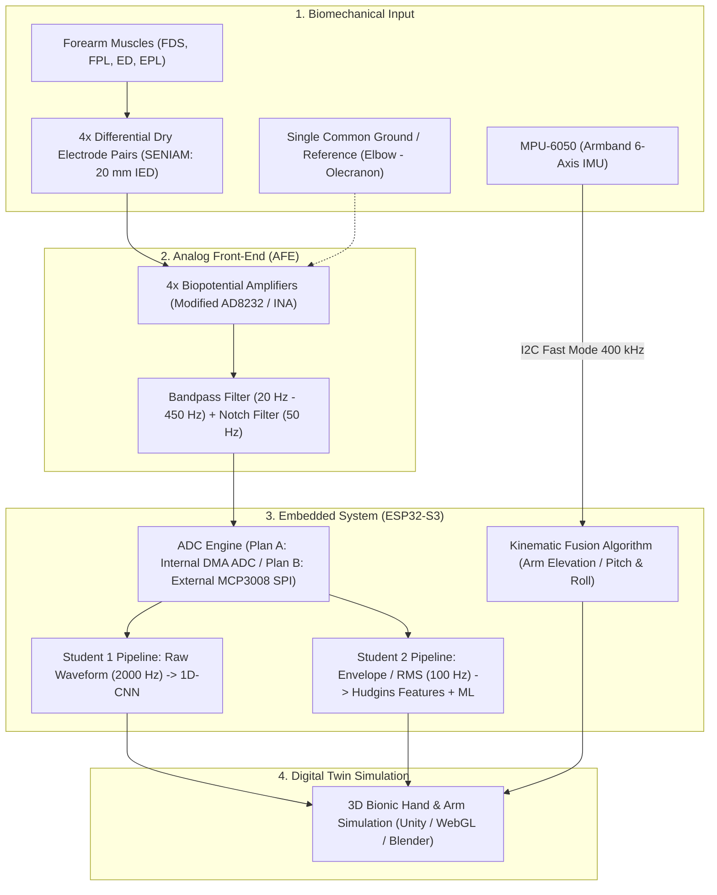

# Nuada: Bionic Hand Movement Estimation via TinyML

[](#)
[](docs/datasheets/esp32-s3_datasheet_en.pdf)
[](#)
[%20%2B%20MPU--6050-orange.svg)](#)

**Nuada** is an edge-computing wearable prosthesis control framework that processes forearm surface electromyography (sEMG) signals and arm inertial data (IMU). Running directly on a low-power microcontroller (**ESP32-S3**) using **TinyML**, it performs real-time classification of 3-finger bionic hand movements and estimates spatial arm elevation/orientation with minimal latency.

---

## 📌 Executive Summary & Key Highlights

* **3-Finger Bionic Actuation (3-DOF):** Controls the Thumb, Index, and Middle fingers—encompassing over 85% of functional daily human grasp activities (Rest, Power Grasp / Fist, Open Hand, Pinch Grasp, and Pointing).
* **Dry-Electrode Centric Methodology:** Designed exclusively for dry electrodes (conductive fabric / stainless-steel snaps) integrated into a comfortable wearable forearm armband. Dataset acquisition is conducted natively with dry electrodes to eliminate **domain shift / covariate mismatch** during deployment.
* **Hybrid Biomechanical & Kinematic Fusion:** Multi-channel sEMG isolates fine motor intent of digits on the forearm, while an onboard 6-axis **MPU-6050** IMU estimates arm elevation (raising/lowering via pitch angle) and forearm pronation/supination (roll angle) without clumsy shoulder cabling.
* **High-Throughput On-Device TinyML:** Exploits the ESP32-S3 dual-core Xtensa LX7 processor and its proprietary vector/AI instructions (**ESP-NN**) to deliver sub-50 ms inference times and low-latency wireless telemetry (Wi-Fi/BLE) to a 3D digital-twin simulation.

---

## 👥 Engineering Team & Balanced Embedded / RTOS Task Allocation

The project firmware is built on an **SMP FreeRTOS (Real-Time Operating System)** architecture across the dual-core ESP32-S3. **Both researchers actively co-develop the embedded OS infrastructure, C/C++ firmware, peripheral drivers, and on-device machine learning engines**, divided logically across functional cores:

| Contributor | Focus Area | Embedded Firmware & FreeRTOS Architecture (ESP32-S3 C/C++) | Signal & Machine Learning Scope | Hardware Interfacing & System Tasks |
|---|---|---|---|---|
| **Nuri Ziya Kırtepe** | **High-Speed DMA Drivers, Hard Real-Time OS Tasks & Deep TinyML** | • **Hard Real-Time RTOS Tasks (Core 1):** Architects `vTaskEMGSampling` (highest priority) and `vTaskTinyMLInference` pinned to Core 1.<br>• **ISR & RTOS Synchronization:** Implements zero-latency task wakeups via `xTaskNotifyFromISR` triggered by DMA buffer-ready interrupts.<br>• **Inter-Core IPC Queues:** Co-develops cross-core FreeRTOS Queues and Mutexes to stream processed windows from Core 1 to Core 0.<br>• **DMA ADC Driver:** Writes low-level continuous DMA ADC (and SPI fallback) drivers for 2000 Hz 4-channel deterministic sampling.<br>• **Edge AI Engine:** Deploys quantized 1D-CNN via TensorFlow Lite for Microcontrollers (TFLM) with **ESP-NN vector acceleration**. | • **Raw Time-Series Analysis:** Frequency response and time-domain waveform preprocessing in Python.<br>• **Deep Learning:** 1D-CNN and MLP model training, post-training INT8 quantization, and hardware inference latency profiling. | • Multi-channel dry electrode analog signal routing.<br>• Dataset collection and automated temporal labeling protocol.<br>• Dynamic Tensor Arena & heap memory optimization. |
| **Evrim Doğa Solmaz** | **DSP Filters, Sensor Fusion, Soft Real-Time OS Tasks & Telemetry** | • **Soft Real-Time RTOS Tasks (Core 0):** Architects `vTaskIMUSampling` (100 Hz deterministic periodic task via `vTaskDelayUntil`) and `vTaskTelemetry` pinned to Core 0.<br>• **Embedded DSP Engine:** Codes real-time IIR bandpass (20–450 Hz) and 50 Hz notch filter cascades in C++.<br>• **IMU Driver & Sensor Fusion:** Writes I2C MPU-6050 driver and implements real-time Complementary / Madgwick filter for arm elevation (Pitch/Roll).<br>• **Feature ML Engine:** Deploys real-time Hudgins feature extraction and SVM inference via lightweight C (`emlearn`).<br>• **Wireless Networking Stack:** Manages FreeRTOS LwIP network tasks for low-latency Wi-Fi UDP / BLE transmission. | • **Feature Engineering:** Hudgins time-domain feature space design (MAV, RMS, WL, ZC, SSC) and dimensionality reduction.<br>• **Classical ML & State Machine:** SVM and shallow MLP classifier training and hyperparameter optimization. | • Core 0 FreeRTOS multi-threading and task stack sizing.<br>• Low-latency wireless telemetry to 3D hand digital-twin.<br>• Real-time hybrid decision state machine. |


---

## 🏛️ System Architecture



---

## 🔬 6-Scenario Experimental Benchmark Matrix (2 Data Pipelines × 3 Models)

To rigorously evaluate embedded efficiency and classification accuracy, both researchers benchmark the exact same **3 model families** across their respective pipelines on the ESP32-S3:

1. **Model A: Support Vector Machine (SVM - Classical ML)** — Ultra-low latency benchmark deployed via C array export (`emlearn` / `micromlgen`).
2. **Model B: Multi-Layer Perceptron (MLP / ANN - Shallow Neural Network)** — Fully-connected architecture executed via TensorFlow Lite for Microcontrollers (TFLM) with INT8 quantization.
3. **Model C: 1D Convolutional Neural Network (1D-CNN - Deep Learning)** — Learns temporal filter representations directly from sEMG waveforms, deployed via TFLM INT8.

| Scenario | Input Representation | Model Architecture | Expected Behavior & Research Hypothesis |
|---|---|---|---|
| **Case 1** | **Raw Time-Series** (4 ch × 200 ms = 800 floats) | **SVM** | Prone to curse of dimensionality and overfitting; high inference latency on microcontrollers. |
| **Case 2** | **Raw Time-Series** (4 ch × 200 ms = 800 floats) | **MLP (ANN)** | Captures basic non-linearities but misses inter-sample temporal correlation. |
| **Case 3** | **Raw Time-Series** (4 ch × 200 ms tensor) | **1D-CNN** | **Optimal Raw Model.** Convolutional kernels intrinsically filter raw noise and isolate Motor Unit Action Potentials (MUAP). |
| **Case 4** | **Engineered Features** (4 ch × 4 features = 16 floats) | **SVM** | **Ultra-Fast Baseline.** High classification boundary margin with sub-millisecond execution. |
| **Case 5** | **Engineered Features** (4 ch × 4 features = 16 floats) | **MLP (ANN)** | **Balanced Champion Candidate.** Excellent accuracy with exceptionally low RAM/Flash footprint. |
| **Case 6** | **Engineered Features** (4 ch × 4 features = 16 floats) | **1D-CNN** | Redundant spatial convolutions on static time-invariant feature vectors; analyzed as architectural inefficiency. |

### Evaluation Metrics on Hardware:
* **Classification Performance:** Test Accuracy (%), F1-Score, and Confusion Matrix.
* **Inference Latency:** Execution time per prediction window on ESP32-S3 (ms).
* **Dynamic RAM Overhead:** Peak tensor arena / heap allocation (KB).
* **Non-Volatile Storage (Flash):** Compiled model binary footprint (KB).

---

## 🔌 Hardware Specifications & Bus Timing Analysis

### 1. Main Processor: ESP32-S3
* **Core:** Dual-Core Xtensa LX7 @ 240 MHz with Vector/AI Extension (ESP-NN).
* **SRAM:** 512 KB internal SRAM + optional external octal PSRAM.
* **SPI Controllers:** Total of 4 SPI peripherals. User-accessible: **SPI2 (FSPI)** and **SPI3 (HSPI)** with dedicated DMA channels.
* **Internal ADC:** Two 12-bit SAR ADCs. Supports Continuous DMA mode for up to 100 kHz+ uninterrupted multi-channel sampling.

### 2. ADC Strategy: Primary vs. Fallback
* **PLAN A (Primary & Recommended): ESP32-S3 Internal ADC1 (Continuous DMA Mode)**
  * Uses dedicated ADC1 pins (GPIO 1 to GPIO 4) to eliminate Wi-Fi RF conflict.
  * Captures 2000 Hz per channel without CPU intervention.
  * Eliminates external converter ICs, reducing PCB size and Bill of Materials (BOM) cost.
* **PLAN B (Fallback / Redundancy): External MCP3008 (SPI 10-Bit ADC)**
  * 8-channel, 10-bit successive approximation register ADC running at 200 kSPS.
  * Interfaced via SPI2 at 1.5 MHz bus clock. Reading 4 channels takes 64 µs (only **12.8%** of the 500 µs sampling interval).

### 3. Inertial Measurement Unit: MPU-6050
* **Interface:** I2C Fast-Mode (400 kHz bus clock).
* **Bandwidth Usage:** Reading 14 bytes (3-axis Accel + Temp + 3-axis Gyro) takes ~0.315 ms. At a 100 Hz sampling rate, bus utilization is merely **3.15%**.

---

## 📂 Repository Directory Layout

```
nuada-bionic-hand-tinyml/
├── docs/
│   ├── anatomy_and_signal_acquisition.md   # Comprehensive biomechanics, SENIAM protocols & hardware guide
│   ├── hardware_comparison.md              # Microcontroller and platform trade-off evaluation
│   └── datasheets/                         # Archived manufacturer datasheets & technical summaries
│       ├── datasheets_summary.md           # Bus timing calculations, electrical ranges, and pinouts
│       ├── esp32-s3_datasheet_en.pdf       # Espressif ESP32-S3 Official Datasheet
│       ├── ad8232_datasheet.pdf            # Analog Devices AD8232 Front-End Datasheet
│       ├── mcp3008_datasheet.pdf           # Microchip MCP3008 10-Bit ADC Datasheet
│       ├── mpu6050_datasheet.pdf           # InvenSense MPU-6050 6-Axis MotionTracking Datasheet
│       └── ads1115_datasheet.pdf           # Texas Instruments ADS1115 16-Bit ADC Datasheet
├── images/                                 # Scientific illustrations, anatomical diagrams & electrode maps
├── .gitignore                              # Git exclusion rules for embedded and Python environments
└── README.md                               # Primary project portal and documentation
```

---

## 📚 Technical Documentation Links
* [Biomechanics, Anatomy & Signal Acquisition Manual](docs/anatomy_and_signal_acquisition.md)
* [Datasheets, Electrical Specifications & Bus Timing Report](docs/datasheets/datasheets_summary.md)
* [Embedded MCU Comparative Study](docs/hardware_comparison.md)
