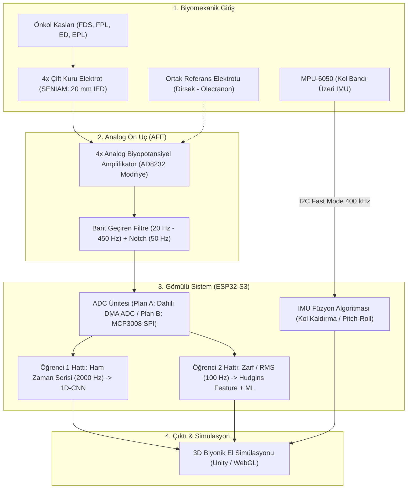

# Nuada: Bionic Hand movement estimation via TinyML

[](#)
[](docs/datasheets/esp32-s3_datasheet_en.pdf)
[](#)
[%20%2B%20MPU--6050-orange.svg)](#)

**Nuada**, önkol yüzeyel elektromiyografi (sEMG) sinyallerini ve kol eylemsizlik verilerini (IMU) işleyerek, mikrodenetleyici üzerinde (uçta yapay zeka - TinyML) 3 parmaklı biyonik el hareketlerini ve kol yönelimini gerçek zamanlı kestiren giyilebilir bir protez kontrol sistemidir.

---

## 📌 Proje Özeti ve Temel Özellikler

* **3 Parmaklı Biyonik Kontrol (3-DOF):** İnsan elinin günlük işlevlerinin %85'ini oluşturan Başparmak, İşaret ve Orta parmak hareketlerini sınıflandırır (Dinlenme, Güçlü Kavrama/Yumruk, El Açık, Çimdik/Pinch, İşaret Etme).
* **Kuru Elektrot Odaklı Tasarım:** Islak jel elektrotlar yerine, nihai giyilebilir kol bandında kuru elektrotlar (metal snap / iletken kumaş) kullanılır. Alan kayması (domain shift) riskini önlemek için veri toplama da doğrudan kuru elektrotlarla gerçekleştirilir.
* **Hibrit Kinematik & Biyomekanik:** Parmak hareketleri 4 kanallı önkol sEMG sinyalleriyle; kol kaldırma ve indirme hareketleri ise 6 eksenli MPU-6050 IMU sensörüyle takip edilir.
* **Yüksek Performanslı Uçta Çıkarım (TinyML):** ESP32-S3 mikrokontrolcüsünün vektör/AI komut seti (ESP-NN) kullanılarak düşük gecikmeli (< 50 ms) çıkarım yapılır ve sonuçlar kablosuz (Wi-Fi/BLE) olarak 3D simülasyona aktarılır.

---

## 👥 Takım ve Görev Dağılımı

Proje, iki paralel araştırma hattı üzerinden yürütülmektedir:

| Öğrenci | Odak Alanı | Sinyal Hattı | Model / Algoritma | Donanım & Entegrasyon |
|---|---|---|---|---|
| **Nuri Ziya Kırtepe** | **Ham Veri & Derin Öğrenme (TinyML)** | 1000 – 2000 Hz Ham sEMG (Raw Waveform) | 1D-CNN (Convolutional Neural Network) & Spektrogram | Hızlı ADC hattı (DMA / SPI MCP3008), Veri seti toplama & etiketleme |
| **Evrim Doğa Solmaz** | **DSP Filtreleme, Öznitelik Çıkarımı & Gömülü Yazılım** | Doğrultulmuş & Filtrelenmiş Zarf Sinyali (Envelope / RMS, 50-100 Hz) | Hudgins Öznitelik Vektörü (MAV, WL, ZC, SSC) + SVM / Random Forest | MPU-6050 açı hesabı (kol kaldırma), ESP32-S3 Wi-Fi/BLE simülasyon haberleşmesi |

---

## 🏛️ Sistem Mimarisi



---

## 🔌 Donanım Seçimleri ve Veri Yolu (Bus) Özellikleri

### 1. Ana İşlemci: ESP32-S3
* **Çekirdek:** Çift Çekirdekli Xtensa LX7 @ 240 MHz (AI Vektör hızlandırıcılı).
* **Hafıza:** 512 KB dahili SRAM + harici Flash.
* **SPI Sayısı:** Toplam 4 SPI denetleyicisi (Kullanıcıya açık: **SPI2/FSPI** ve **SPI3/HSPI**).
* **ADC Mimarisi:** İki adet 12-bit SAR ADC (ADC1 ve ADC2). Continuous DMA modu ile işlemci yükü olmadan saniyede 100 kHz+ örnekleme yeteneği.

### 2. ADC Stratejisi: Plan A vs. Plan B
* **PLAN A (Öncelikli & Minimalist): ESP32-S3 Dahili ADC1 (DMA Modu)**
  * Wi-Fi ile çakışmayan ADC1 pinleri (GPIO 1-4) kullanılır.
  * Kanal başı 2000 Hz örnekleme CPU yükü olmadan doğrudan DMA arabelleğine akar.
  * Harici çip gerektirmez, sıfır ek maliyet.
* **PLAN B (Yedek / Sigorta): SPI Tabanlı MCP3008**
  * 8 Kanal, 10-bit, 200 kSPS dönüşüm hızı.
  * ESP32-S3 SPI2 (FSPI) hattı üzerinden 1.5 MHz saat hızıyla bağlanır.
  * 4 kanalın okunması sadece 64 µs sürer (2000 Hz periyodunun sadece %12.8 bus kullanım oranı).

### 3. Eylemsizlik Sensörü: MPU-6050
* **Arayüz:** I2C Fast-Mode (400 kHz saat frekansı).
* **İşlev:** Kolun yukarı/aşağı kaldırılması (Pitch açısı) ve bilek dönüşünün (Roll açısı) sıfır gecikmeyle kestirimi.

---

## 📂 Proje Dizin Yapısı

```
nuada/
├── docs/
│   ├── anatomy_and_signal_acquisition.md   # Biyomekanik anatomi, SENIAM ve elektrot yerleşimi
│   ├── hardware_comparison.md              # MCU ve donanım karşılaştırma analizi
│   └── datasheets/                         # İndirilen teknik PDF'ler ve bus analizleri
│       ├── datasheets_summary.md           # Datasheet özetleri ve bus zamanlama hesapları
│       ├── esp32-s3_datasheet_en.pdf       # Espressif ESP32-S3 Datasheet
│       ├── ad8232_datasheet.pdf            # Analog Devices AD8232 Datasheet
│       ├── mcp3008_datasheet.pdf           # Microchip MCP3008 ADC Datasheet
│       ├── mpu6050_datasheet.pdf           # InvenSense MPU-6050 IMU Datasheet
│       └── ads1115_datasheet.pdf           # Texas Instruments ADS1115 Datasheet
├── images/                                 # Biyomekanik illüstrasyonlar ve yerleşim şemaları
├── .gitignore                              # Git hariç tutma kuralları
├── GEMINI.md                               # Proje kuralları ve stil kılavuzu
└── README.md                               # Ana proje dokümanı
```

---

## 📖 Dokümantasyon Bağlantıları
* [Biyomekanik Anatomi ve Sinyal Toplama Rehberi](docs/anatomy_and_signal_acquisition.md)
* [Datasheet ve Veri Yolu Analiz Raporu](docs/datasheets/datasheets_summary.md)
* [Donanım Karşılaştırma Dokümanı](docs/hardware_comparison.md)
