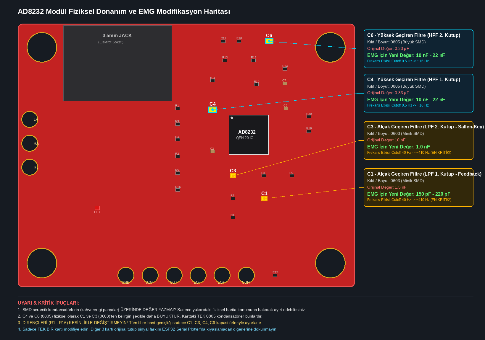

# AD8232 EMG Donanımsal Modifikasyon ve Filtre Dönüşüm Rehberi

Bu belge, **Nuada Bionic Hand** projesi kapsamında kullanılan Analog Devices **AD8232** tek kanallı biyopotansiyel analog ön uç kartının, fabrika çıkışı olan **EKG (0.5 Hz - 40 Hz)** bandından **yüzeyel EMG (sEMG: 16 Hz - 410 Hz)** bandına donanımsal olarak dönüştürülme sürecini, resmi kaynak doğrulamalarını ve laboratuvar uygulama adımlarını içerir.

---

## 1. Doğrulama ve Resmi Kaynaklar (Komponent Tespiti Kanıtları)

Kart üzerindeki elemanların konumlarının, değerlerinin ve devre bağlantılarının doğruluğu 2 temel resmi kaynağa dayanır:

### Kaynak 1: Analog Devices AD8232 Resmi Veri Sayfası (Datasheet Rev. A)
* **Doküman:** Analog Devices AD8232 Technical Documentation ([ad8232_datasheet.pdf](file:///home/zia/Documents/school/graduation-project/nuada/nuada-bionic-hand-tinyml/docs/datasheets/ad8232_datasheet.pdf))
* **İlgili Bölümler:**
  * **Sayfa 21 - 22 (High-Pass Filtering):** Şekil 56 (*Alternative Two-Pole High-Pass Filter*).  
    Formül: `f_HP = 10 / (2 * π * sqrt(R1 * C1 * R2 * C2))`  
    Bu kat, elektrot potansiyeli ve kol hareket gürültüsünü (motion artifact) yok eden 2 kutuplu aktif yüksek geçiren filtredir.
  * **Sayfa 23 (Low-Pass Filtering and Gain):** Şekil 60 (*Schematic for a Two-Pole Low-Pass Filter - Sallen-Key Topology*).  
    Formül: `f_LP = 1 / (2 * π * sqrt(R1 * C1 * R2 * C2))`  
    Kazanç: `Gain = 1 + (R3 / R4)`  
    Bu kat, enstrümantasyon amfisinden çıkan sinyali 11 kat yükselten ve yüksek frekanslı gürültüyü süzen 2 kutuplu Sallen-Key alçak geçiren filtredir.

### Kaynak 2: SparkFun AD8232 Açık Kaynak Donanım Tasarım Dosyaları (SEN-12650)
Piyasadaki kırmızı AD8232 breakout modülleri, açık kaynaklı SparkFun tasarımının birebir klonudur. Resmi Eagle PCB tasarım dosyaları doğrudan incelenmiştir:
* **Resmi SparkFun GitHub Deposu:** `https://github.com/sparkfun/AD8232_Heart_Rate_Monitor`
* **Devre Şeması (Schematic):** `Hardware/AD8232_Heart_Rate_Monitor.sch`
* **Baskı Devre Yerleşimi (Board):** `Hardware/AD8232_Heart_Rate_Monitor.brd`

---

## 2. Devre Şeması Netlist ve Fiziksel Koordinat Eşleşme Tablosu

Eagle CAD `.brd` ve `.sch` dosyalarından çıkarılan mikrometre hassasiyetindeki netlist ve X-Y fiziksel konumları aşağıdadır (Kartın sol-alt köşesi origin: X=0 mm, Y=0 mm):

| Eleman Kodu | Görevi / Devre Katı | Kılıf Boyutu | Fiziksel Koordinat (X, Y) | Bağlı Olduğu Hatlar (Nets) | Orijinal EKG Değeri | EMG İçin Yeni Değer | Değişim Durumu |
| :--- | :--- | :--- | :--- | :--- | :--- | :--- | :--- |
| **C3** | Alçak Geçiren Filtre (LPF 2. Kutup) | **0603** (1.6 x 0.8 mm) | X = 22.73 mm, Y = 11.81 mm | `U1.OPAMP+` ile `REFOUT` | 10 nF | **1.0 nF** | **ZORUNLU (En Kritik)** |
| **C1** | Alçak Geçiren Filtre (LPF Feedback) | **0603** (1.6 x 0.8 mm) | X = 26.04 mm, Y = 9.40 mm | `SIGNAL_OUT` ile `Net N$9` | 1.5 nF | **150 pF veya 220 pF** | **ZORUNLU (En Kritik)** |
| **C4** | Yüksek Geçiren Filtre (HPF 1. Kutup) | **0805** (2.0 x 1.25 mm) | X = 20.57 mm, Y = 18.80 mm | `U1.HPDRIVE` ile `U1.HPSENSE` | 0.33 µF | **10 nF veya 22 nF** | İsteğe Bağlı / Opsiyonel |
| **C6** | Yüksek Geçiren Filtre (HPF 2. Kutup) | **0805** (2.0 x 1.25 mm) | X = 26.54 mm, Y = 26.04 mm | `U1.SW` ile `REFOUT` | 0.33 µF | **10 nF veya 22 nF** | İsteğe Bağlı / Opsiyonel |
| **R6, R7** | LPF Sallen-Key Seri Dirençleri | 0603 | X = 22.73 mm | `IAOUT` -> `OPAMP+` | 1 MΩ (Kod: 105) | 1 MΩ | **DEĞİŞTİRİLMEZ** |
| **R8, R9** | LPF Op-Amp Kazanç Dirençleri | 0603 | X = 25.97, 28.96 mm | Kazanç Ağı (`1 + R9/R8 = 11`) | R8: 100 kΩ, R9: 1 MΩ | Aynı | **DEĞİŞTİRİLMEZ** |
| **R11, R13** | HPF Geri Besleme Dirençleri | 0603 | X = 20.57, 21.84 mm | DC Blocking Entegratör | 10 MΩ (Kod: 106) | 10 MΩ | **DEĞİŞTİRİLMEZ** |

> [!NOTE]
> **Fiziksel Boyut İpucu:** Kartın üzerindeki **tek 0805 kılıflı** (yani gözle görülür şekilde büyük) iki adet kondansatör **C4 ve C6**'dır. Diğer tüm pasif elemanlar 0603 kılıfındadır.

---

## 3. Fiziksel Donanım Yerleşim Haritası

Kartın üzerindeki elemanların birebir fiziksel yerleşimi ve lehimleme hedefleri aşağıdaki haritada detaylı olarak gösterilmiştir:



*Görseli ayrı bir sekmede veya tam ekranda açmak için:* **[🖼️ ad8232_emg_mod_guide.png Görselini Aç (Tıklayın)](./ad8232_emg_mod_guide.png)**

*(Not: Markdown dosyasını IDE içinde önizleme modunda (Ctrl+Shift+V / Markdown Preview) açtığınızda yukarıdaki grafik harita renkli ve yüksek çözünürlüklü olarak doğrudan belgenin içinde görüntülenecektir).*

---

### ASCII Kaba Referans Şeması (Hızlı Bakış İçin):
```
 +---------------------------------------------------------+
 |  [ 3.5 mm JACK ]                         (C6) [0805]    |  <- C6 en üst kenardadır
 |  (Elektrot Girişi)                                      |
 |                                                         |
 |                    [C4] [0805]                          |  <- C4 çipin sol-üst çaprazındadır
 |                   (Büyük SMD)                           |
 |                                                         |
 |                                 +---------+             |
 |        [RA]                     | AD8232  |             |
 |        [LA]                     | QFN-20  |             |
 |        [RL]                     |  Entegre|             |
 |                                 +---------+             |
 |                                      |                  |
 |                                     (C3) [0603]         |  <- C3 çipin tam altındadır
 |                                      |                  |
 |                                     (C1) [0603]         |  <- C1 sağ-alt çaprazdadır
 |  (LED)                                                  |
 |                                                         |
 |      [GND]   [3.3V]   [OUT]   [LO-]   [LO+]   [!SDN]    |
 +---------------------------------------------------------+
```

---

## 4. Frekans Hesaplamaları ve Değer Seçimi

### A. Alçak Geçiren Filtre (LPF) — Kas Sinyali Bant Genişliği
Kas kasılması sırasında üretilen motor ünite aksiyon potansiyelleri 10 Hz - 450 Hz arasındadır.
* **Mevcut Durum:**  
  `R6 = 1 MΩ`, `R7 = 1 MΩ`, `C1 = 1.5 nF`, `C3 = 10 nF`  
  `f_LP = 1 / (2 * π * 10^6 * sqrt(1.5*10^-9 * 10*10^-9)) = 41.09 Hz` (Sinyal 41 Hz'de kesilmektedir).
* **Modifiye Durum (Hedef ~410 Hz):**  
  `C3 = 1.0 nF (1000 pF)`, `C1 = 150 pF` (veya standart 220 pF) takıldığında:  
  `f_LP = 1 / (2 * π * 10^6 * sqrt(150*10^-12 * 1.0*10^-9)) = 410.9 Hz`  
  Böylece sEMG bandının %95'i analog filtreden kayıpsız geçer.

### B. Yüksek Geçiren Filtre (HPF) — Hareket Gürültüsü Engelleme
* **Mevcut Durum:**  
  `R1 = R2 = 10 MΩ`, `C4 = C6 = 0.33 µF`  
  `f_HP = 10 / (2 * π * 10^7 * 0.33*10^-6) = 0.48 Hz`  
* **Modifiye Durum (Hedef ~16 Hz):**  
  `C4 = C6 = 10 nF` takıldığında:  
  `f_HP = 10 / (2 * π * 10^7 * 10*10^-9) = 15.91 Hz`  
  Elektrot kayması ve cilt esneme hareket gürültüsü donanımda kesilir.

> [!TIP]
> **Yazılımsal Kurtarma Kolaylığı:**  
> C4 ve C6'yı değiştirmek istemezseniz orijinal bırakabilirsiniz. 0.5 Hz - 16 Hz arasındaki hareket gürültüsü, ESP32-S3 üzerinde firmware düzeyinde çalıştıracağımız 2. derece dijital Butterworth yüksek geçiren filtre ile yazılımsal olarak yok edilebilir. Ancak donanımsal 40 Hz analog filtresi (C1, C3) analogda kırpıldığı için yazılımla geri getirilemez. **Bu nedenle en kritik işlem sadece C1 ve C3'ün değiştirilmesidir.**

---

## 5. Komponent Seçenekleri: SMD mi, Normal Bacaklı (Through-Hole) Mercimek mi?

Hocanızın *"Kondansatör üzerinde değer yazmadığı için doğru alıp almadığınızı bilemezsiniz"* uyarısı çok haklı bir laboratuvar gerçeğidir. Bu sorunu çözmek için iki yönteminiz vardır:

### Yöntem 1: Standart Bacaklı (Through-Hole) Mercimek Disk Kondansatör (TAVSİYE EDİLEN)
* **Avantajı:** Üzerinde standart 3 haneli kapasite kodu **baskılıdır**. Çıplak gözle okunur, ölçü aletine ihtiyaç duymadan hocanıza doğruluğu kanıtlanabilir.
* **Gereken Parçalar:**
  * **C3 için:** Üzerinde `102` yazan mercimek kondansatör (`10 x 10^2 pF = 1.0 nF`).
  * **C1 için:** Üzerinde `151` (`150 pF`) veya `221` (`220 pF`) yazan mercimek kondansatör.
  * *(Opsiyonel)* **C4 ve C6 için:** Üzerinde `103` yazan mercimek kondansatör (`10 x 10^3 pF = 10 nF`).
* **Temin:** Üniversite elektronik laboratuvarının çekmeceli komponent kutularında bol miktarda bulunur.

### Yöntem 2: SMD Yüzey Montaj (0603 Kılıf) Kondansatör
* **Avantajı:** Kart üzerinde sıfır çıkıntı yapar, estetik durur.
* **Dezavantajı:** Üzerinde hiçbir kod yazmaz. Şerit poşetinden çıktığı an LCR metre ile ölçülmezse karıştırılabilir.

---

## 6. Adım Adım Laboratuvar Rework Prosedürü

### Gerekli Araçlar:
1. İnce uçlu lehimleme havyası (veya ısı ayarlı SMD sıcak hava istasyonu).
2. Hassas SMD cımbızı.
3. İnce lehim teli (0.5 mm veya 0.8 mm) ve lehim pastası (flux).
4. Lehim emme teli (desoldering wick).
5. Sıcak silikon tabancası (mekanik sabitleme için).

---

### Adım 1: Sadece Tek Bir Kartı Ayırın (Prototip Kuralı)
* Elinizdeki 4 adet AD8232 kartının **dördünü birden kesinlikle sökmeyin.**
* Yalnızca **1 adet kartı** modifikasyon için ayırın. Diğer 3 kart orijinal kalsın.

### Adım 2: Pad Koparmadan Güvenli Sökme ("Lehim Damlası" Tekniği)
> [!CAUTION]
> Asla parçayı lehim tam erimeden cımbızla çekip kanırtmayın! PCB'deki bakır lehim adacığı (pad) yırtılırsa kart tamir edilemez hale gelir.

* **Klasik Havya ile Sökme:**
  1. Havyanın ucuna bolca taze lehim alın (ucunda parlak bir lehim damlası oluşsun).
  2. Sökeceğiniz parçanın (önce C3, sonra C1) **her iki ucuna birden aynı anda** bu lehim damlasıyla dokunun.
  3. 1 - 2 saniye içinde her iki tarafın lehimi aynı anda eriyecektir.
  4. Lehim eridiği an parçayı cımbızla yukarı değil, **yana doğru hafifçe kaydırın.** Parça pad'den ayrılacaktır.
* **Sıcak Hava İstasyonu ile Sökme:**
  * Sıcaklık: 320 °C - 340 °C.
  * Hava debisi: **En düşük seviye (1 veya 2)** (yandaki parçaları uçurmamak için).
  * Cımbızla parça tutulur, 3-4 saniye sıcak hava gezdirilip lehim eriyince parça kaldırılır.

### Adım 3: Padleri Temizleme
* Boşta kalan iki bakır adacığa hafifçe flux sürün.
* Lehim emme teli veya havyayı hafifçe sürterek yüzeyi düz bir hale getirin.

---

### Adım 4: Yeni Kondansatörü Lehimleme

#### Eğer Bacaklı (Mercimek) Kondansatör Kullanıyorsanız:
1. **Bacakları Hazırlama:** Kondansatörün bacaklarını yan keskiyle **3 - 4 mm** boyunda kesin.
2. **"L" Bükümü:** Bacak uçlarını cımbızla 90 derece dışa doğru bükerek taban gibi düz bir yüzey oluşturun.
3. **Lehimleme:** Karttaki bir pade minik lehim dokundurun. Kondansatörün bir bacağını buraya oturtup havyayla sabitleyin. Soğuyunca diğer bacağı lehimleyin.
4. **Hayati Adım - Mekanik Sabitleme (Sıcak Silikon):** Bacaklı parça yüzeyde havada duracağı için, kablo takarken çarparsa kaldıraç etkisiyle SMD pad'i koparabilir. Lehim bittikten sonra kondansatörün gövdesi ile kartın arasına **küçük bir damla sıcak silikon (hot glue)** sıkın. Taş gibi sabitlenecektir.

#### Eğer SMD 0603 Kondansatör Kullanıyorsanız:
1. Pad'lerden birine hafif lehim damlatın.
2. Cımbızla 0603 parçayı tutup yerine hizalayın, havyayla ilk ucu tutturun.
3. Parça sabitlenince diğer ucu lehimleyin.

---

### Adım 5: Canlı Doğrulama ve Karşılaştırma Testi

1. Modifiye edilmemiş (orijinal) bir AD8232 kartını ESP32-S3'e bağlayın (`3.3V`, `GND`, `OUT` -> ADC pinine).
2. Arduino IDE veya PlatformIO üzerinden Serial Plotter'ı açın. Ön kola elektrotları bağlayıp yumruk sıkın. Sinyalin genliğini ve tepkisini kaydedin.
3. Modifiye ettiğiniz kartı bağlayıp aynı kas hareketini tekrarlayın.
4. **Beklenen Sonuç:** Modifiye kartta kas liflerinin yüksek frekanslı motor aksiyon patlamaları çok daha keskin, canlı ve zengin görünmelidir.

---

## 7. Tez / Rapor İçin Akademik Atıf Formatı

Bu donanım modifikasyonunu mezuniyet tezi veya proje raporunda açıklarken aşağıdaki referansı kullanabilirsiniz:

> *"Yüzeyel EMG (sEMG) sinyallerinin spektral güç yoğunluğu 10 Hz - 450 Hz frekans bandında yoğunlaşmaktadır. Ticari AD8232 ön uç modülü fabrikasyon olarak kalp EKG sinyalleri için 40 Hz alçak geçiren filtre (LPF) ile sınırlandırıldığından, Analog Devices AD8232 veri sayfası (Rev. A, Sayfa 23, Şekil 60) ve SparkFun SEN-12650 açık kaynak donanım şeması referans alınarak Sallen-Key LPF katındaki C1 (1.5 nF -> 150 pF) ve C3 (10 nF -> 1.0 nF) kapasitörleri değiştirilmiş, analog kesim frekansı 410.9 Hz'e yükseltilmiştir."*
