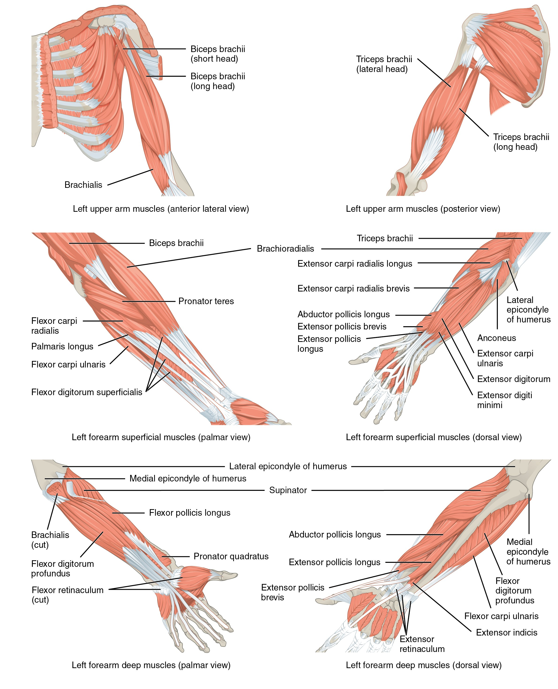
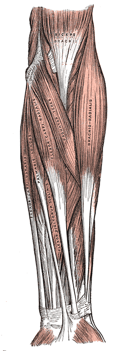
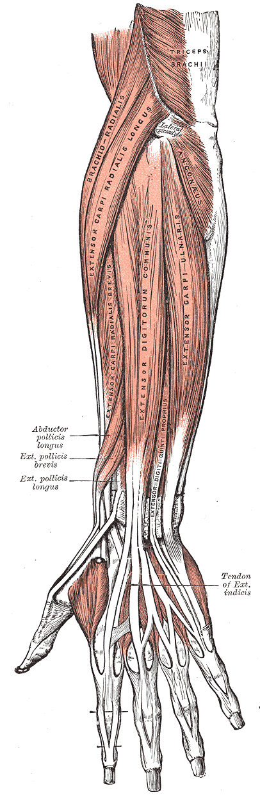
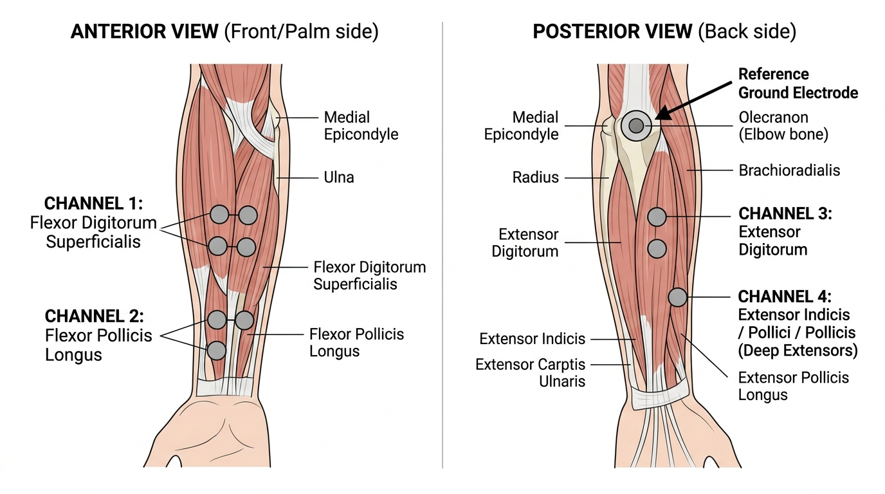
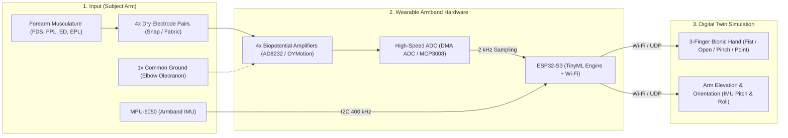

# Nuada: Bionic Hand Movement Estimation via TinyML
## Biomechanical Anatomy, Signal Acquisition Architecture & Experimental Matrix (v2.0)

This comprehensive technical reference details the functional forearm anatomy for 3-finger bionic actuation, dry-electrode interface physics (mitigating domain shift), hardware analog front-ends (AFE), high-speed ADC architectures, 6-axis IMU kinematic tracking, and a rigorous **6-scenario experimental benchmark matrix** designed for academic evaluation.

---

## 1. Hardware Signal Analysis & ADC Feasibility: Raw Waveforms vs. Muscle Envelope

The advisory guidance:
> *"One researcher focuses on raw data, while the other applies filtering and works on feature representations."*

defines the primary architectural constraints for sampling rates, bus throughput, and ADC selection.

```
                         [ Muscle Biopotential (sEMG) ]
                                      │
                         (10 µV - 5 mV, 20 - 500 Hz)
                                      ▼
               [ Analog Front-End (AFE: AD8232 / OYMotion / INA) ]
                                      │
                                      ▼
             [ High-Speed ADC (MCP3008 SPI / DMA ADC: 1000 - 2000 Hz) ]
                                      │
         ┌────────────────────────────┴────────────────────────────┐
         ▼                                                         ▼
 ┌──────────────────────────────────┐     ┌──────────────────────────────────┐
 │ STUDENT 1: RAW TIME-SERIES LINE  │     │ STUDENT 2: FEATURE-BASED LINE    │
 │ (Unfiltered Discrete Waveforms)  │     │ (DSP Filtering + Hudgins Vector) │
 ├──────────────────────────────────┤     ├──────────────────────────────────┤
 │ • Input: 4 ch × 200 samples      │     │ • Input: 4 ch × 4 features       │
 │   (800-dimensional raw tensor)   │     │   (16-dimensional MAV,RMS,WL,ZC) │
 │ • Input Size: High (800 floats)  │     │ • Input Size: Compact (16 floats)│
 │ • Edge Hardware: ESP32-S3        │     │ • Edge Hardware: ESP32-S3        │
 │ • 3-Model Benchmark:             │     │ • 3-Model Benchmark:             │
 │   1. Model A: SVM (emlearn)      │     │   1. Model A: SVM (emlearn)      │
 │   2. Model B: MLP (TFLM INT8)    │     │   2. Model B: MLP (TFLM INT8)    │
 │   3. Model C: 1D-CNN (TFLM)      │     │   3. Model C: 1D-CNN (TFLM)      │
 └──────────────────────────────────┘     └──────────────────────────────────┘
```

### Why ADS1115 Fails for Multi-Channel Raw sEMG:
1. **Conversion Speed Ceiling:** The maximum conversion throughput of the ADS1115 is strictly **860 SPS**.
2. **Channel Division & I2C Overhead:** In a 4-channel configuration where the internal multiplexer must be sequentially switched over I2C, effective per-channel throughput degrades to **~150–200 SPS**.
3. **Severe Aliasing Distortion:** The principal energetic frequency band of human skeletal muscle action potentials spans **50 Hz to 250 Hz**, with harmonic components up to **450 Hz**. Per the Nyquist-Shannon sampling theorem, capturing these waveforms without irreversible spectral aliasing requires a minimum sampling frequency of **1000 Hz – 2000 Hz (1–2 kHz) per channel**. At 200 SPS, frequencies above 100 Hz fold back into the baseband, destroying motor unit action potential (MUAP) morphology.

### The Unified Engineering Solution:
* **Primary Path: ESP32-S3 Internal ADC1 (Continuous DMA Driver)**
  * Operates without CPU overhead by streaming conversions directly into circular DMA buffers.
  * Achieves up to 100 kHz+ aggregate throughput, easily providing 2000 Hz per channel across 4 channels.
  * Utilizes ADC1 pins (GPIO 1–4) to prevent RF transmitter contention. Zero additional hardware cost.
* **Secondary Path (Hardware Redundancy): SPI-Driven MCP3008**
  * 8-channel, 10-bit successive approximation register ADC capable of 200 kSPS.
  * Interfaced via SPI2 at 1.5 MHz clock frequency. Reading 4 channels takes only 64 µs, utilizing just 12.8% of the 500 µs sampling budget.
  * Provides a noise-isolated fallback if high-power Wi-Fi bursts cause analog ground bounce on the MCU.

---

## 2. Dry vs. Wet Electrodes: The Domain Shift Phenomenon

> [!IMPORTANT]
> **Biomedical Reality Check:**
> Training an ML model on data gathered with wet Ag/AgCl electrodes and deploying it with dry electrodes causes acute classification failure due to **Covariate Shift / Domain Mismatch**.

* **Wet Ag/AgCl Gel Electrodes:** An electrolyte gel bridges the stratum corneum, providing low skin contact impedance (**5 – 20 kΩ**) and high signal-to-noise ratio (SNR).
* **Dry Electrodes (Stainless Steel / Conductive Fabric):** No electrolytic interface exists. Contact impedance is orders of magnitude higher (**100 kΩ – 1 MΩ+**). The metal-skin interface exhibits capacitive coupling, and mechanical micro-movements induce pronounced motion artifacts and baseline wander.
* **Implementation Protocol:** To guarantee that the TinyML model generalizes to real-world usage, **all dataset acquisition and model training must be performed directly using the dry electrode configuration** integrated into the wearable armband.

---

## 3. Targeted Forearm Anatomy for 3-Finger Bionic Actuation

Focusing on a **3-Finger Configuration (Thumb, Index, and Middle)** captures **85% of everyday human grasping utility** while drastically reducing mechanical and algorithmic complexity.


*(Source: OpenStax Anatomy & Physiology — [Wikimedia Commons](https://commons.wikimedia.org/wiki/File:1120_Muscles_that_Move_the_Forearm.jpg))*

### 3.1 Classified Gestural Vocabulary (5 Classes)
1. **Rest / Baseline:** Arm relaxed, no deliberate motor unit recruitment.
2. **Power Grasp / Fist:** Simultaneous flexion of Thumb, Index, and Middle fingers (holding a cup or ball).
3. **Open Hand:** Complete extension and abduction of all three digits (releasing an object).
4. **Pinch Grasp:** Precision opposition between the tips of the Thumb and Index finger (holding a pen or coin).
5. **Point:** Index finger fully extended while Thumb and Middle finger remain flexed (pressing a button).

---

### 3.2 Muscle-to-Channel Mapping




| Channel | Target Muscle Group | Anatomical Location | Primary Biomechanical Action |
|---|---|---|---|
| **CH1** | **Flexor Digitorum Superficialis (FDS)** | Anterior/Ventral forearm (Medial) | Middle and index finger proximal interphalangeal flexion (Fist & Pinch). |
| **CH2** | **Flexor Pollicis Longus (FPL)** | Anterior/Ventral forearm (Radial edge) | Thumb distal phalanx flexion and opposition (Pinch & Power Grasp). |
| **CH3** | **Extensor Digitorum (ED)** | Posterior/Dorsal forearm (Central) | Extension of index and middle digits (Open Hand). |
| **CH4** | **Extensor Pollicis & Indicis (EPL/EI)** | Posterior/Dorsal forearm (Radial/Distal) | Independent extension of the thumb and index finger (Point gesture). |

---

## 4. Electrode Placement & SENIAM Standard Protocols



### 4.1 SENIAM International Rules
1. **Inter-Electrode Distance (IED):** Center-to-center electrode distance must be precisely **20 mm**.
2. **Longitudinal Fiber Alignment:** Differential electrode pairs must be aligned **parallel** to the underlying muscle fiber trajectory.
3. **Innervation Zone Avoidance:** Electrodes must be situated midway between the muscle belly center and the distal tendon insertion, avoiding motor endplates.
4. **Common Ground Reference:** A single reference electrode (GND / DRL) is placed over an electrically neutral, bony landmark: the elbow **Olecranon** or the wrist **Ulnar Styloid Process**.

```
          Elbow (Olecranon) ─── [ COMMON REFERENCE / GROUND ELECTRODE ]
                  │
      ┌───────────┴───────────────────────────────────────────┐
      │ Forearm Circumference (4–6 cm distal to elbow crease) │
      │                                                       │
      │  [CH1 +]      [CH2 +]       [CH3 +]       [CH4 +]     │
      │    │ 20mm       │ 20mm        │ 20mm        │ 20mm    │  <-- Parallel to fibers
      │  [CH1 -]      [CH2 -]       [CH3 -]       [CH4 -]     │
      │   (FDS)        (FPL)         (ED)        (EPL/EI)     │
      └───────────────────────────────────────────────────────┘
```

---

## 5. Converting the AD8232 ECG Front-End for sEMG Operation

The low-cost **AD8232** integrated front-end is factory-configured for electrocardiography (ECG) with a passband of **0.5 Hz – 40 Hz**. Because surface EMG requires **20 Hz – 450 Hz**, the passive SMD filter network must be adapted.

```
[ AD8232 Factory ECG Configuration ] ──> Passband: 0.5 Hz - 40 Hz
                                                   │
                       (Resistor & Capacitor Value Modification)
                                                   ▼
[ AD8232 Modified sEMG Configuration ] ──> Passband: 20 Hz - 450 Hz
```

### Necessary Hardware Modifications:
1. **High-Pass Filter Adjustment (0.5 Hz -> 20 Hz):**
   Reduce input coupling capacitors C_1 and C_2 to raise the lower corner frequency to 20 Hz, eliminating baseline drift and respiratory artifacts.
2. **Low-Pass Sallen-Key Filter Adjustment (40 Hz -> 450 Hz):**
   Replace the feedback capacitor C_3 in the second-order Sallen-Key filter stage (typically 1.5 nF) with a **100 pF – 220 pF** capacitor to shift the upper cutoff to ~450 Hz.
3. *Commercial Off-the-Shelf Alternative:* If SMD desoldering is impractical, integrated sEMG modules such as the **OYMotion Gravity EMG** or **MyoWare v2.0** offer pre-tuned 20–450 Hz analog stages.

---

## 6. Spatial Arm Kinematics: 6-Axis IMU (MPU-6050) Integration


*(Source: OpenStax Anatomy & Physiology — [Wikimedia Commons](https://commons.wikimedia.org/wiki/File:1119_Muscles_that_Move_the_Humerus.jpg))*

Arm elevation (raising/lowering via the Deltoid) and elbow flexion (Biceps/Triceps) originate from proximal shoulder and upper-arm muscles.

### The Hybrid Kinematic Architecture:
* **The Forearm Armband:** Encapsulates the ESP32-S3, 4-channel sEMG AFE, and an **MPU-6050 6-axis IMU**.
* **Operational Decoupling:**
  * **Digits (3-DOF):** Forearm sEMG feeds the TinyML classifier to actuate the virtual digits.
  * **Arm Elevation (Pitch Angle):** Accelerometer gravity vectors feed a complementary filter on the MCU to calculate arm elevation (0^\circ - 90^\circ).
  * **Pronation / Supination (Roll Angle):** Gyroscope integration tracks forearm twist.
* **Advantage:** Eliminates all cabling to the shoulder or chest, housing the complete sensing suite in a single compact forearm band.

---

## 7. Experimental Benchmark Matrix (2 Data Pipelines × 3 Models = 6 Cases)

To provide comprehensive empirical depth, both researchers train and evaluate the **same 3 model families** across their respective data representations on the ESP32-S3:

### 7.1 Evaluated Model Families
1. **Model A: Support Vector Machine (SVM - Classical ML)**
   Linear or RBF-kernel baseline deployed to C arrays via `emlearn` or `micromlgen`.
2. **Model B: Multi-Layer Perceptron (MLP / ANN - Shallow Neural Network)**
   Fully-connected network (e.g., 64-32 units) quantized to INT8 and run via TensorFlow Lite for Microcontrollers (TFLM).
3. **Model C: 1D Convolutional Neural Network (1D-CNN - Deep Learning)**
   Temporal convolutional kernels that extract temporal representations directly from time-series windows, deployed via TFLM INT8.

---

### 7.2 The 2 × 3 Benchmark Matrix

| Case | Input Representation | Model Architecture | Expected Characteristics & Hypothesis |
|---|---|---|---|
| **Case 1** | **Raw Time-Series** <br>(4 ch × 200 samples = 800 floats) | **SVM** | High dimensional input leads to overfitting; high support vector count increases MCU inference latency. |
| **Case 2** | **Raw Time-Series** <br>(4 ch × 200 samples = 800 floats) | **MLP (ANN)** | Flattened 800-input network captures gross activation but ignores intra-window temporal phase structure. |
| **Case 3** | **Raw Time-Series** <br>(4 ch × 200 samples tensor) | **1D-CNN** | **Optimal Raw Model.** Convolutional kernels isolate MUAP waveforms and phase shifts despite raw noise. |
| **Case 4** | **Feature Vector** <br>(4 ch × 4 features = 16 floats) | **SVM** | **Ultra-Fast Baseline.** High margin separation on compact 16-D Hudgins vector with sub-millisecond execution. |
| **Case 5** | **Feature Vector** <br>(4 ch × 4 features = 16 floats) | **MLP (ANN)** | **Balanced Champion Candidate.** Excellent classification accuracy with minimal RAM/Flash footprint. |
| **Case 6** | **Feature Vector** <br>(4 ch × 4 features = 16 floats) | **1D-CNN** | Convolutions across static, time-invariant feature dimensions introduce unnecessary parameter overhead. |

---

### 7.3 Embedded Evaluation Metrics
All 6 scenarios will be benchmarked on physical ESP32-S3 hardware using:
1. **Classification Accuracy & F1-Score (%):** Evaluated against a held-out dry-electrode test dataset.
2. **Inference Latency (ms):** Wall-clock duration per single forward-pass prediction measured using hardware microsecond timers.
3. **RAM Consumption (KB):** Peak dynamic memory utilization (Tensor Arena / Heap).
4. **Flash Footprint (KB):** Non-volatile binary size of the model.

---

## 8. Research Division & Team Allocation

| Task Scope | Student 1 (Raw Data & Deep Learning Line) | Student 2 (Feature Engineering & Embedded System Line) |
|---|---|---|
| **Data Ingestion** | High-speed ADC sampling (**1000–2000 Hz Raw sEMG**) and sliding window segmentation. | Real-time digital filtering (Bandpass 20–450 Hz + 50 Hz Notch) and Hudgins feature extraction (MAV, RMS, WL, ZC) in C++. |
| **Model Training** | Train and optimize **SVM, MLP, and 1D-CNN (Cases 1, 2, 3)** on raw tensors in Python/PyTorch/Keras. | Train and optimize **SVM, MLP, and 1D-CNN (Cases 4, 5, 6)** on 16-D feature vectors in scikit-learn/Keras. |
| **ESP32-S3 Deployment** | Deploy raw models via TFLite Micro / emlearn and record execution latency and memory. | Deploy feature models to MCU and benchmark combined feature extraction + inference latency. |
| **System Integration** | Dry electrode dataset acquisition software and data labeling protocol. | MPU-6050 complementary filtering (arm elevation) and low-latency Wi-Fi/BLE communication to 3D hand simulation. |

---

## 9. Executive Decision Summary



1. **Actuation Scope:** 3 Digits (Thumb, Index, Middle) mapped across 5 core gesture classes.
2. **Electrode Physics:** Dry electrodes natively integrated to eliminate domain shift.
3. **Kinematic Tracking:** 6-axis MPU-6050 IMU handles arm elevation and forearm roll without shoulder wires.
4. **ADC Architecture:** Primary Plan A uses internal ESP32-S3 DMA ADC; Plan B uses SPI-driven MCP3008.
5. **Academic Benchmarking:** 6-case cross-validation matrix (Raw vs. Features across SVM, MLP, 1D-CNN) evaluated on MCU accuracy, latency, and memory.
